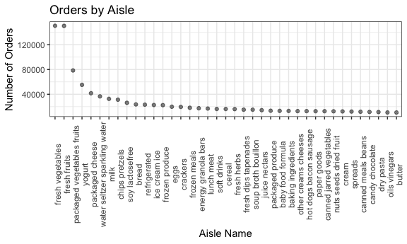
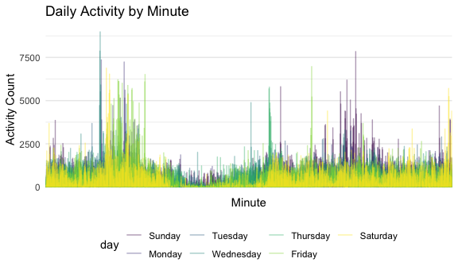

p8105_hw3_enp2116
================
Emily Potts
2022-10-06

\*\* This homework includes figures; the readability of your embedded
plots (e.g. font sizes, axis labels, titles) will be assessed in
Problems 1+ \*\*

# Problem 1

Loading the instacart dataset from p8105.datasets:

``` r
data("instacart")

instacart = 
  instacart %>% 
  as_tibble(instacart)
```

Exploration of the dataset:

The `instacart` dataset is tidy, with 1384617 rows and 15 columns,
indicating we have data on 1384617 different products ordered through
instacart and we have information on 15 different dimensions in each of
these product orders. The `instacart` dataset contains the variables:
order_id, product_id, add_to_cart_order, reordered, user_id, eval_set,
order_number, order_dow, order_hour_of_day, days_since_prior_order,
product_name, aisle_id, department_id, aisle, department.

Key variables include user_id, order_id, and aisle. User_id has values
such as 112108, 79431, 42756, 17227, 56463, 125030, with 131209 distinct
users in total. Order_id such as 1, 36, 38, 96, 98, 112, with 131209
total orders in this dataset. Finally, aisle has values such as yogurt,
other creams cheeses, fresh vegetables, fresh vegetables, canned meat
seafood, fresh fruits.

For a single order, there are multiple observations, such as all the
products for order 1:

    ## # A tibble: 8 × 15
    ## # Groups:   order_id [1]
    ##   order_id product_id add_to_c…¹ reord…² user_id eval_…³ order…⁴ order…⁵ order…⁶
    ##      <int>      <int>      <int>   <int>   <int> <chr>     <int>   <int>   <int>
    ## 1        1      49302          1       1  112108 train         4       4      10
    ## 2        1      11109          2       1  112108 train         4       4      10
    ## 3        1      10246          3       0  112108 train         4       4      10
    ## 4        1      49683          4       0  112108 train         4       4      10
    ## 5        1      43633          5       1  112108 train         4       4      10
    ## 6        1      13176          6       0  112108 train         4       4      10
    ## 7        1      47209          7       0  112108 train         4       4      10
    ## 8        1      22035          8       1  112108 train         4       4      10
    ## # … with 6 more variables: days_since_prior_order <int>, product_name <chr>,
    ## #   aisle_id <int>, department_id <int>, aisle <chr>, department <chr>, and
    ## #   abbreviated variable names ¹​add_to_cart_order, ²​reordered, ³​eval_set,
    ## #   ⁴​order_number, ⁵​order_dow, ⁶​order_hour_of_day

-   How many aisles are there, and which aisles are the most items
    ordered from?

<!-- -->

    ## [1] 134

    ## # A tibble: 134 × 2
    ##    aisle                          n_obs
    ##    <chr>                          <int>
    ##  1 fresh vegetables              150609
    ##  2 fresh fruits                  150473
    ##  3 packaged vegetables fruits     78493
    ##  4 yogurt                         55240
    ##  5 packaged cheese                41699
    ##  6 water seltzer sparkling water  36617
    ##  7 milk                           32644
    ##  8 chips pretzels                 31269
    ##  9 soy lactosefree                26240
    ## 10 bread                          23635
    ## # … with 124 more rows

There are 134 aisles. Fresh vegetables and fresh fruits are ordered
most, with 150609 orders and 150473, respectively.

-   Plot showing the number of items ordered in each aisle, limiting
    this to aisles with more than 10000 items ordered, and ordering
    aisles by number of orders.

``` r
instacart %>%
  group_by(aisle) %>%
  summarize(
    n_obs = n()) %>% 
  filter(n_obs > 10000) %>% 
  mutate(aisle = forcats::fct_reorder(aisle, n_obs, desc)) %>% 
  ggplot(aes(x = aisle, y = n_obs)) + geom_point(aes(aisle, n_obs), alpha = .5) +
  labs(
    title = "Orders by Aisle",
    x = "Aisle Name",
    y = "Number of Orders"
    )  +  theme_bw() + theme(legend.position = "bottom") + theme(axis.text.x = element_text(angle = 90))
```



-   Table showing the three most popular items in each of the aisles
    “baking ingredients”, “dog food care”, and “packaged vegetables
    fruits”, including the number of times each item is ordered.

``` r
instacart %>% 
  filter(aisle == "baking ingredients" | aisle == "dog food care" | aisle == "packaged vegetables fruits") %>%
  group_by(aisle) %>% 
  count(product_name) %>% 
  mutate(rank = min_rank(desc(n))) %>% 
  filter(rank < 4) %>% 
  arrange(desc(n)) %>%
  knitr::kable()
```

| aisle                      | product_name                                  |    n | rank |
|:---------------------------|:----------------------------------------------|-----:|-----:|
| packaged vegetables fruits | Organic Baby Spinach                          | 9784 |    1 |
| packaged vegetables fruits | Organic Raspberries                           | 5546 |    2 |
| packaged vegetables fruits | Organic Blueberries                           | 4966 |    3 |
| baking ingredients         | Light Brown Sugar                             |  499 |    1 |
| baking ingredients         | Pure Baking Soda                              |  387 |    2 |
| baking ingredients         | Cane Sugar                                    |  336 |    3 |
| dog food care              | Snack Sticks Chicken & Rice Recipe Dog Treats |   30 |    1 |
| dog food care              | Organix Chicken & Brown Rice Recipe           |   28 |    2 |
| dog food care              | Small Dog Biscuits                            |   26 |    3 |

-   Table showing the mean hour of the day at which Pink Lady Apples and
    Coffee Ice Cream are ordered on each day of the week, formatted as a
    readable 2 x 7 table.

``` r
instacart %>%
  filter(product_name == "Pink Lady Apples" | product_name == "Coffee Ice Cream") %>%
  group_by(product_name, order_dow) %>%
  summarize(mean_hour = mean(order_hour_of_day)) %>%
  spread(key = order_dow, value = mean_hour) %>%
  knitr::kable(digits = 2)
```

| product_name     |     0 |     1 |     2 |     3 |     4 |     5 |     6 |
|:-----------------|------:|------:|------:|------:|------:|------:|------:|
| Coffee Ice Cream | 13.77 | 14.32 | 15.38 | 15.32 | 15.22 | 12.26 | 13.83 |
| Pink Lady Apples | 13.44 | 11.36 | 11.70 | 14.25 | 11.55 | 12.78 | 11.94 |

# Problem 2

This problem uses five weeks of accelerometer data collected on a 63
year-old male with BMI 25, who was admitted to the Advanced Cardiac Care
Center of Columbia University Medical Center and diagnosed with
congestive heart failure (CHF). The data can be downloaded here. In this
spreadsheet, variables activity.\* are the activity counts for each
minute of a 24-hour day starting at midnight.

-   Loading, tidying, and otherwise wrangling the data; including all
    originally observed variables and values; have useful variable
    names; include a weekday vs weekend variable; and encode data with
    reasonable variable classes.

``` r
accel_data =
  read_csv("data/accel_data.csv") %>%
  janitor::clean_names() %>%
  pivot_longer(
    activity_1:activity_1440,
    names_to = "minute", 
    names_prefix = "activity_",
    values_to = "activity_count") %>%
  mutate(
    split_week = case_when(day == "Saturday" ~ 'weekend',
                          day == "Sunday" ~ 'weekend',
                          day == "Monday" ~ 'weekday',
                          day == "Tuesday" ~ 'weekday',
                          day == "Wednesday" ~ 'weekday',
                          day == "Thursday" ~ 'weekday',
                          day == "Friday" ~ 'weekday')) %>% 
  relocate(split_week) %>% 
  mutate(day = fct_relevel(day, c("Sunday", "Monday", "Tuesday", "Wednesday", "Thursday", "Friday", "Saturday")))
```

Describing the resulting dataset:

The `accel` dataset is tidy, with 50400 rows and 6 columns, indicating
we have accelerometer data for 50400 different minutes. The `accel`
dataset contains variables: activity_count, day, day_id, minute,
split_week, week. Day has values such as Friday, Monday, Saturday,
Sunday, Thursday, Tuesday, week such as 1, 2, 3, 4, 5, and split_week
such as weekday, weekend. For each single day, there are 1,440 activity
counts, which are broken up by minute. Activity counts per minute take
on values such as 88.3777778, 82.2444444, 64.4444444, 70.0444444,
75.0444444, 66.2666667.

-   Traditional analyses of accelerometer data focus on the total
    activity over the day. Using your tidied dataset, aggregate across
    minutes to create a total activity variable for each day, and create
    a table showing these totals. Are any trends apparent?

``` r
accel_data %>% 
  group_by(day, week) %>% 
  summarize(daily_total_activity = sum(activity_count)) %>% 
  pivot_wider(names_from = day, values_from = daily_total_activity) %>%
  knitr::kable(digits = 0)
```

| week | Sunday | Monday | Tuesday | Wednesday | Thursday | Friday | Saturday |
|-----:|-------:|-------:|--------:|----------:|---------:|-------:|---------:|
|    1 | 631105 |  78828 |  307094 |    340115 |   355924 | 480543 |   376254 |
|    2 | 422018 | 295431 |  423245 |    440962 |   474048 | 568839 |   607175 |
|    3 | 467052 | 685910 |  381507 |    468869 |   371230 | 467420 |   382928 |
|    4 | 260617 | 409450 |  319568 |    434460 |   340291 | 154049 |     1440 |
|    5 | 138421 | 389080 |  367824 |    445366 |   549658 | 620860 |     1440 |

Tuesday, Wednesday, and Thursdays all seem to have the consistent
amounts of total activity (hovering around 300000-450000), whereas
Fridays through Mondays are more variable (low of under 80000, high of
almost 700000). These are expected patterns for weekdays versus
weekends/extended weekends. A weird observation comes across in Saturday
Weeks 4 & 5, where I predict that the accelerometer was not worn and the
machine’s default (NULL) is a 1 for each minute.

-   Accelerometer data allows the inspection activity over the course of
    the day. Make a single-panel plot that shows the 24-hour activity
    time courses for each day and use color to indicate day of the week.
    Describe in words any patterns or conclusions you can make based on
    this graph.

``` r
ggplot(accel_data, aes(x = minute, y = activity_count)) +
  geom_line(aes(color = day), alpha = .4) +
  labs(
    title = "Daily Activity by Minute",
    x = "Minute",
    y = "Activity Count"
    )  + scale_x_discrete(breaks = NULL)
```



Based on this graph, we can see that the distribution of activity
throughout the day tends to be bimodal, with a lull before noon. On
weekends, we see a larger nighttime peak and on weekdays we see a larger
morning peak.

# Problem 3

Loading the NY NOAA dataset from p8105.datasets:

``` r
data("ny_noaa")

noaa_df = 
  ny_noaa %>% 
  as_tibble(ny_noaa)
noaa_df
```

    ## # A tibble: 2,595,176 × 7
    ##    id          date        prcp  snow  snwd tmax  tmin 
    ##    <chr>       <date>     <int> <int> <int> <chr> <chr>
    ##  1 US1NYAB0001 2007-11-01    NA    NA    NA <NA>  <NA> 
    ##  2 US1NYAB0001 2007-11-02    NA    NA    NA <NA>  <NA> 
    ##  3 US1NYAB0001 2007-11-03    NA    NA    NA <NA>  <NA> 
    ##  4 US1NYAB0001 2007-11-04    NA    NA    NA <NA>  <NA> 
    ##  5 US1NYAB0001 2007-11-05    NA    NA    NA <NA>  <NA> 
    ##  6 US1NYAB0001 2007-11-06    NA    NA    NA <NA>  <NA> 
    ##  7 US1NYAB0001 2007-11-07    NA    NA    NA <NA>  <NA> 
    ##  8 US1NYAB0001 2007-11-08    NA    NA    NA <NA>  <NA> 
    ##  9 US1NYAB0001 2007-11-09    NA    NA    NA <NA>  <NA> 
    ## 10 US1NYAB0001 2007-11-10    NA    NA    NA <NA>  <NA> 
    ## # … with 2,595,166 more rows

Exploration of this dataset: To that end, write a short description of
the dataset, noting the size and structure of the data, describing some
key variables, and indicating the extent to which missing data is an
issue.

Then, do or answer the following (commenting on the results of each):

-   Do some data cleaning. Create separate variables for year, month,
    and day. Ensure observations for temperature, precipitation, and
    snowfall are given in reasonable units. For snowfall, what are the
    most commonly observed values? Why?

-   You can find the NOAA documentation hereLinks to an external site.;
    it might give you insight into the units being used to record the
    snow variable. When considering alternative units, your discussion
    might be related to the question regarding the most common
    observations for snowfall. Is it possible that the original recorded
    data might have been converted to different units for this dataset?
    \_\_\_\_\_\_\_\_\_\_\_\_\_

-   As for the final plot, you should filter values based on the
    original definition of snowfall (i.e., using the original units). To
    that end, you might want to consider retaining both the original
    variable snow as well as your proposal for a variable with a more
    sensical unit. As long as you’re clear about how you label values
    and units in your visualizations, you should be good!

------------------------------------------------------------------------

-   Make a two-panel plot showing the average max temperature in January
    and in July in each station across years. Is there any observable /
    interpretable structure? Any outliers?

-   line plots

-   For this problem, you want to find the average of tmax for every
    unique combination of station ID, year, and month (perhaps consider
    grouping by these three variables to obtain the desired result).
    Then, you will want to construct two plots - one for January and one
    for July - that show the average maximum temperature (vertical axis)
    against years (horizontal axis) for every station.

-   spaghetti plot w suppressed labels

-   Then for each year of the data, create distribution plots of snow.
    So, for example, if the dataset spanned the years 1997 to 1999, you
    would have three separate distribution plots of (the filtered
    observations of) snow by year.

-   You should make a single plot for part (i) and a single plot for
    part (ii). Then, you should combine these two plots side by side
    into a single-panel exhibit; you can find a refresher on how to do
    that hereLinks to an external site.. For the first plot, you are
    correct that “vs” implies tmax should be on the vertical axis and
    that tmin should be on the horizontal axis.

facet_grid

-   Make a two-panel plot showing (i) tmax vs tmin for the full dataset
    (note that a scatterplot may not be the best option); and (ii) make
    a plot showing the distribution of snowfall values greater than 0
    and less than 100 separately by year.

-   filter the data to only include rows such that 0 \< snow \< 100.

-   You should compute the average for max temperature for each station
    separately and then plot the two plots side by side.

-   patchwork

-   We want to limit the values of snowfall to the criteria specified
    and then use ggplot to plot the distribution (density plot).
