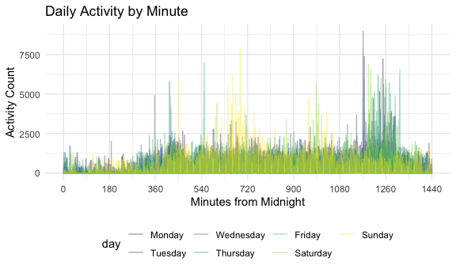
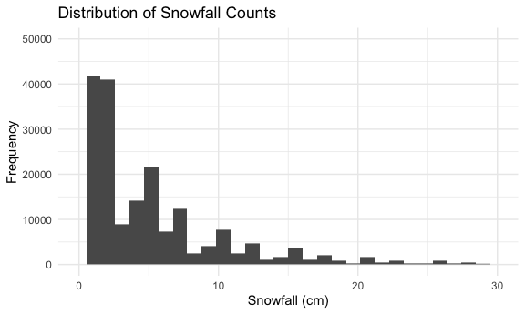
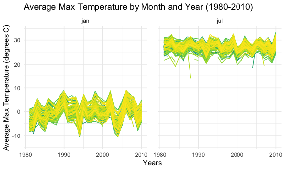

p8105_hw3_enp2116
================
Emily Potts
2022-10-06

# Problem 1

Loading the instacart dataset from p8105.datasets:

``` r
data("instacart")

instacart = 
  instacart %>% 
  as_tibble(instacart)
```

Exploration of the dataset:

The `instacart` dataset is tidy, with 1384617 rows and 15 columns,
indicating we have data on 1384617 different products ordered through
instacart and we have information on 15 different dimensions in each of
these product orders. The `instacart` dataset contains the variables:
order_id, product_id, add_to_cart_order, reordered, user_id, eval_set,
order_number, order_dow, order_hour_of_day, days_since_prior_order,
product_name, aisle_id, department_id, aisle, department.

Key variables include user_id, order_id, and aisle. User_id has values
such as 112108, 79431, 42756, 17227, 56463, 125030, with 131209 distinct
users in total. Order_id such as 1, 36, 38, 96, 98, 112, with 131209
total orders in this dataset. Finally, aisle has values such as yogurt,
other creams cheeses, fresh vegetables, fresh vegetables, canned meat
seafood, fresh fruits.

For a single order, there are multiple observations, such as all the
products for order 1:

    ## # A tibble: 8 × 15
    ## # Groups:   order_id [1]
    ##   order_id product_id add_to_c…¹ reord…² user_id eval_…³ order…⁴ order…⁵ order…⁶
    ##      <int>      <int>      <int>   <int>   <int> <chr>     <int>   <int>   <int>
    ## 1        1      49302          1       1  112108 train         4       4      10
    ## 2        1      11109          2       1  112108 train         4       4      10
    ## 3        1      10246          3       0  112108 train         4       4      10
    ## 4        1      49683          4       0  112108 train         4       4      10
    ## 5        1      43633          5       1  112108 train         4       4      10
    ## 6        1      13176          6       0  112108 train         4       4      10
    ## 7        1      47209          7       0  112108 train         4       4      10
    ## 8        1      22035          8       1  112108 train         4       4      10
    ## # … with 6 more variables: days_since_prior_order <int>, product_name <chr>,
    ## #   aisle_id <int>, department_id <int>, aisle <chr>, department <chr>, and
    ## #   abbreviated variable names ¹​add_to_cart_order, ²​reordered, ³​eval_set,
    ## #   ⁴​order_number, ⁵​order_dow, ⁶​order_hour_of_day

-   How many aisles are there, and which aisles are the most items
    ordered from?

<!-- -->

    ## [1] 134

    ## # A tibble: 134 × 2
    ##    aisle                          n_obs
    ##    <chr>                          <int>
    ##  1 fresh vegetables              150609
    ##  2 fresh fruits                  150473
    ##  3 packaged vegetables fruits     78493
    ##  4 yogurt                         55240
    ##  5 packaged cheese                41699
    ##  6 water seltzer sparkling water  36617
    ##  7 milk                           32644
    ##  8 chips pretzels                 31269
    ##  9 soy lactosefree                26240
    ## 10 bread                          23635
    ## # … with 124 more rows

There are 134 aisles. Fresh vegetables and fresh fruits are ordered
most, with 150609 orders and 150473, respectively.

-   Plot showing the number of items ordered in each aisle, limiting
    this to aisles with more than 10000 items ordered, and ordering
    aisles by number of orders.

``` r
instacart %>%
  group_by(aisle) %>%
  summarize(
    n_obs = n()) %>% 
  filter(n_obs > 10000) %>% 
  mutate(aisle = forcats::fct_reorder(aisle, n_obs, desc)) %>% 
  ggplot(aes(x = aisle, y = n_obs)) + geom_point(aes(aisle, n_obs), alpha = .5) +
  labs(
    title = "Orders by Aisle",
    x = "Aisle Name",
    y = "Number of Orders"
    )  +  theme_bw() + theme(legend.position = "bottom") + theme(axis.text.x = element_text(angle = 90))
```


-   Table showing the three most popular items in each of the aisles
    “baking ingredients”, “dog food care”, and “packaged vegetables
    fruits”, including the number of times each item is ordered.

``` r
instacart %>% 
  filter(aisle == "baking ingredients" | aisle == "dog food care" | aisle == "packaged vegetables fruits") %>%
  group_by(aisle) %>% 
  count(product_name) %>% 
  mutate(rank = min_rank(desc(n))) %>% 
  filter(rank < 4) %>% 
  arrange(desc(n)) %>%
  knitr::kable()
```

| aisle                      | product_name                                  |    n | rank |
|:---------------------------|:----------------------------------------------|-----:|-----:|
| packaged vegetables fruits | Organic Baby Spinach                          | 9784 |    1 |
| packaged vegetables fruits | Organic Raspberries                           | 5546 |    2 |
| packaged vegetables fruits | Organic Blueberries                           | 4966 |    3 |
| baking ingredients         | Light Brown Sugar                             |  499 |    1 |
| baking ingredients         | Pure Baking Soda                              |  387 |    2 |
| baking ingredients         | Cane Sugar                                    |  336 |    3 |
| dog food care              | Snack Sticks Chicken & Rice Recipe Dog Treats |   30 |    1 |
| dog food care              | Organix Chicken & Brown Rice Recipe           |   28 |    2 |
| dog food care              | Small Dog Biscuits                            |   26 |    3 |

-   Table showing the mean hour of the day at which Pink Lady Apples and
    Coffee Ice Cream are ordered on each day of the week, formatted as a
    readable 2 x 7 table.

``` r
instacart %>%
  filter(product_name == "Pink Lady Apples" | product_name == "Coffee Ice Cream") %>%
  group_by(product_name, order_dow) %>%
  summarize(mean_hour = mean(order_hour_of_day)) %>%
  spread(key = order_dow, value = mean_hour) %>%
  knitr::kable(digits = 2)
```

| product_name     |     0 |     1 |     2 |     3 |     4 |     5 |     6 |
|:-----------------|------:|------:|------:|------:|------:|------:|------:|
| Coffee Ice Cream | 13.77 | 14.32 | 15.38 | 15.32 | 15.22 | 12.26 | 13.83 |
| Pink Lady Apples | 13.44 | 11.36 | 11.70 | 14.25 | 11.55 | 12.78 | 11.94 |

# Problem 2

This problem uses five weeks of accelerometer data collected on a 63
year-old male with BMI 25, who was admitted to the Advanced Cardiac Care
Center of Columbia University Medical Center and diagnosed with
congestive heart failure (CHF). The data can be downloaded here. In this
spreadsheet, variables activity.\* are the activity counts for each
minute of a 24-hour day starting at midnight.

-   Loading, tidying, and otherwise wrangling the data; including all
    originally observed variables and values; having useful variable
    names; including a weekday vs weekend variable; and encoding data
    with reasonable variable classes.

``` r
accel_data =
  read_csv("data/accel_data.csv") %>%
  janitor::clean_names() %>%
  pivot_longer(
    activity_1:activity_1440,
    names_to = "minute", 
    names_prefix = "activity_",
    values_to = "activity_count") %>%
  mutate(
    split_week = case_when(day == "Saturday" ~ 'weekend',
                          day == "Sunday" ~ 'weekend',
                          day == "Monday" ~ 'weekday',
                          day == "Tuesday" ~ 'weekday',
                          day == "Wednesday" ~ 'weekday',
                          day == "Thursday" ~ 'weekday',
                          day == "Friday" ~ 'weekday')) %>% 
  relocate(split_week) %>% 
  mutate(day = fct_relevel(day, c("Monday", "Tuesday", "Wednesday", "Thursday", "Friday", "Saturday", "Sunday")),
         minute = as.numeric(minute))
```

Describing the resulting dataset:

The `accel` dataset is tidy, with 50400 rows and 6 columns, indicating
we have accelerometer data for 50400 different minutes. The `accel`
dataset contains variables: activity_count, day, day_id, minute,
split_week, week. Day has values such as Friday, Monday, Saturday,
Sunday, Thursday, Tuesday, week such as 1, 2, 3, 4, 5, and split_week
such as weekday, weekend. For each single day, there are 1,440 activity
counts, which are broken up by minute. Activity counts per minute take
on values such as 88.3777778, 82.2444444, 64.4444444, 70.0444444,
75.0444444, 66.2666667.

-   Traditional analyses of accelerometer data focus on the total
    activity over the day. Using your tidied dataset, aggregate across
    minutes to create a total activity variable for each day, and create
    a table showing these totals. Are any trends apparent?

``` r
accel_data %>% 
  group_by(day, week) %>% 
  summarize(daily_total_activity = sum(activity_count)) %>% 
  pivot_wider(names_from = day, values_from = daily_total_activity) %>%
  knitr::kable(digits = 0)
```

| week | Monday | Tuesday | Wednesday | Thursday | Friday | Saturday | Sunday |
|-----:|-------:|--------:|----------:|---------:|-------:|---------:|-------:|
|    1 |  78828 |  307094 |    340115 |   355924 | 480543 |   376254 | 631105 |
|    2 | 295431 |  423245 |    440962 |   474048 | 568839 |   607175 | 422018 |
|    3 | 685910 |  381507 |    468869 |   371230 | 467420 |   382928 | 467052 |
|    4 | 409450 |  319568 |    434460 |   340291 | 154049 |     1440 | 260617 |
|    5 | 389080 |  367824 |    445366 |   549658 | 620860 |     1440 | 138421 |

Tuesday, Wednesday, and Thursdays all seem to have the consistent
amounts of total activity (hovering around 300000-450000), whereas
Fridays through Mondays are more variable (low of under 80000, high of
almost 700000). These are expected patterns for weekdays versus
weekends/extended weekends. A weird observation comes across in Saturday
Weeks 4 & 5, where I predict that the accelerometer was not worn and the
machine’s default (NULL) is a 1 for each minute.

-   Accelerometer data allows the inspection activity over the course of
    the day. Make a single-panel plot that shows the 24-hour activity
    time courses for each day and use color to indicate day of the week.
    Describe in words any patterns or conclusions you can make based on
    this graph.

``` r
accel_data %>% 
ggplot(aes(x = minute, y = activity_count)) +
  geom_line(aes(color = day), alpha = .4) +
  labs(
    title = "Daily Activity by Minute",
    x = "Minutes from Midnight",
    y = "Activity Count"
    )  + scale_x_continuous(breaks = c(0, 180, 360, 540, 720, 900, 1080, 1260, 1440))
```



Based on this graph, we can see that the distribution of activity
throughout the day tends to have a consistent lull in the nighttime
(while sleeping). On Sundays, we see more activity around noon and on
Friday and Saturday, we see more activity at evening. Despite this,
activity counts per minute usually hover around 1225, with more active
time periods mostly under 2500, although staying around 5000 per minute
for some more active periods.

# Problem 3

Loading the NY NOAA dataset from p8105.datasets:

    ## # A tibble: 2,595,176 × 7
    ##    id          date        prcp  snow  snwd tmax  tmin 
    ##    <chr>       <date>     <int> <int> <int> <chr> <chr>
    ##  1 US1NYAB0001 2007-11-01    NA    NA    NA <NA>  <NA> 
    ##  2 US1NYAB0001 2007-11-02    NA    NA    NA <NA>  <NA> 
    ##  3 US1NYAB0001 2007-11-03    NA    NA    NA <NA>  <NA> 
    ##  4 US1NYAB0001 2007-11-04    NA    NA    NA <NA>  <NA> 
    ##  5 US1NYAB0001 2007-11-05    NA    NA    NA <NA>  <NA> 
    ##  6 US1NYAB0001 2007-11-06    NA    NA    NA <NA>  <NA> 
    ##  7 US1NYAB0001 2007-11-07    NA    NA    NA <NA>  <NA> 
    ##  8 US1NYAB0001 2007-11-08    NA    NA    NA <NA>  <NA> 
    ##  9 US1NYAB0001 2007-11-09    NA    NA    NA <NA>  <NA> 
    ## 10 US1NYAB0001 2007-11-10    NA    NA    NA <NA>  <NA> 
    ## # … with 2,595,166 more rows

A short description of the dataset, noting the size and structure of the
data, describing some key variables, and indicating the extent to which
missing data is an issue:

The `noaa_df` dataset has 2595176 rows and 7 columns, indicating we have
weather data on 2595176 different dates and we have information on 7
different dimensions, including date. The `noaa_df` dataset contains the
variables: id, date, prcp, snow, snwd, tmax, tmin. Prcp has values such
as NA, 3, 0, 25, 71, 8, snow such as NA, 3, 0, 5, 64, 13, and snwd such
as NA, 0, 64, 25, 51, 38. Finally, tmax and tmin are originally set up
as character variables, which is not appropriate given they are number
values and should be numeric.

The `noaa_df` dataset does have a decent number of missing data
(variables prcp, snow, snwd, tmax, tmin), most notably with almost 44%
of temperature data missing. This missingness occurs primarily in the
first half of the timeframe, but also in chunks in the second half,
which may be an issue if missingness is not random (related to other
variables in the dataset). The percentages for missing data are listed
by variable:

    ##       id     date     prcp     snow     snwd     tmax     tmin 
    ##  0.00000  0.00000  5.61958 14.68960 22.80331 43.71025 43.71264

-   Some data cleaning. Creating separate variables for year, month, and
    day & ensuring observations for temperature, precipitation, and
    snowfall are given in reasonable units:

To clean this data, I first transformed date into the variables of year,
month, and day. I then converted the temperature variables to numeric
and created new variables with my suggested units for the five variables
of interest. Based on the documentation on the p8105 website for the
NOAA dataset, I intended to have the variables of prcp, snow, and snwd
in measures of cm and temperature data in terms of degrees C, which I
feel is more interpretable by a general audience.

``` r
noaa_tidy = 
  noaa_df %>%
  mutate(year = lubridate::year(date), 
                month = lubridate::month(date), 
                day = lubridate::day(date)) %>% 
  select(-date) %>% 
  mutate(tmax = as.numeric(tmax),
         tmin = as.numeric(tmin)) %>% 
  mutate(prcp_cm = round((prcp * 0.01), 1),
         snow_cm = round((snow * 0.1), 1),
         snwd_cm = round((snwd * 0.1), 1),
         tmax_C = round((tmax * 0.1), 1),
         tmin_C = round((tmin * 0.1), 1)) %>% 
    mutate(month = recode(month, "1" = "jan", "2" = "feb", "3" = "mar", "4" = "apr", "5" = "may", "6" = "jun", "7" = "jul", "8" = "aug", "9" = "sep", "10" = "oct", "11" = "nov", "12" = "dec"))
```

For snowfall, the most commonly observed values are 0, with this value
making up about 77.4% of the data. This is most likely the case because
snow itself is a rare event, even in a cold climate that keeps snow on
the ground (meaning positive values for the snow depth variable).
Additionally, a histogram of the snowfall shows the high right-skew
distribution of the data (lots of low values), which may explain why the
units were originally chosen to be small.

    ##          n
    ## 1 0.773939

``` r
noaa_tidy %>% 
  ggplot(aes(snow_cm)) + geom_histogram() + xlim(0, 30) + ylim(0, 50000) +
  labs(
    title = "Distribution of Snowfall Counts",
    x = "Snowfall (cm)",
    y = "Frequency"
    )
```

    ## Warning: Removed 383707 rows containing non-finite values (stat_bin).

    ## Warning: Removed 2 rows containing missing values (geom_bar).



-   Make a two-panel plot showing the average max temperature in January
    and in July in each station across years. Is there any observable /
    interpretable structure? Any outliers?

``` r
  noaa_tidy %>% 
  group_by(id, month, year) %>% 
  summarize(
    mean_tmax = mean(tmax_C)
  ) %>%
  filter(month == "jan" | month == "jul") %>%
  ggplot(aes(x = year, y = mean_tmax, color = id)) + 
  geom_line() +   
  theme(legend.position="none") + 
  labs(x = "Years", y = "Average Max Temperature (degrees C)", title = "Average Max Temperature by Month and Year (1980-2010)") + 
  facet_grid(~ month) + 
  theme(panel.spacing.x = unit(6, "mm"))
```


Based on our two-panel plot, we can see a clear seasonal trend for
average max temperature when comparing january and july; january has
hovered around 0 degrees C while July around 27.5 degrees C.
Additionally, at a given time point, different stations seem to mirror
one anothers’ trends (within about 10 degrees C). Finally, over the 30
year timespan of interest, average max temperature has not changed much
when comparing within the same months. A key outlier occurs in the July
panel, with a lower temperature of about 14 degrees C in the late 1980s.

-   Make a two-panel plot showing (i) tmax vs tmin for the full dataset
    (note that a scatterplot may not be the best option); and (ii) make
    a plot showing the distribution of snowfall values greater than 0
    and less than 100 separately by year.

``` r
tmax_vs_tmin = 
  noaa_tidy %>% 
  ggplot(aes(x = tmin_C, y = tmax_C)) + 
  geom_hex(bins = 40) +
  labs(x = "Minimum Temperature (degrees C)", y = "Maximum Temperature (degrees C)", subtitle = "Heatmap Plot of Min Temp vs. Max Temp")

snow_dist = 
  noaa_tidy %>% 
  mutate(year = as.factor(year)) %>% 
  group_by(year) %>% 
  filter(0 < snow & snow < 100) %>% 
  ggplot(aes(x = snow, color = year)) + 
  geom_density(alpha = .5) + 
  theme(legend.key.size = unit(1, 'mm'))  + 
  labs(x = "Snowfall (mm)", y = "Density", subtitle = "Density Plot of Snowfall (mm)")

(tmax_vs_tmin + snow_dist)
```


